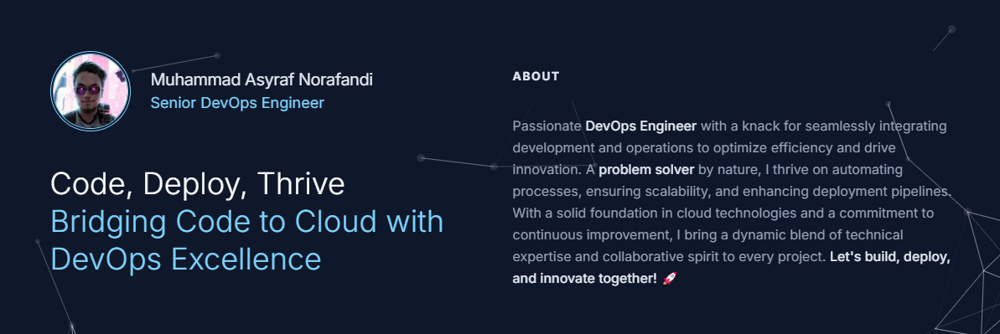

   
    
   

  

    
    
    
    
  

<h2>Technologies I Work With</h2>
<h3>Cloud Providers</h3>

  
  

<h3>Infrastructure</h3>

  
  
  
  
  
  
  
  
  

<h3>Automation</h3>

  
  
  
  

<h3>Monitoring</h3>

  
  
  
  
  

<h3>Full Stack Development</h3>

  
  
  
  
  
  
  

<h2>Latest Articles</h2>

<a target="_blank" href="https://github-readme-medium-recent-article.vercel.app/medium/@asyrafnorafandi/0">

<a target="_blank" href="https://github-readme-medium-recent-article.vercel.app/medium/@asyrafnorafandi/2">

<h2>GitHub Stats</h2>

  
  

